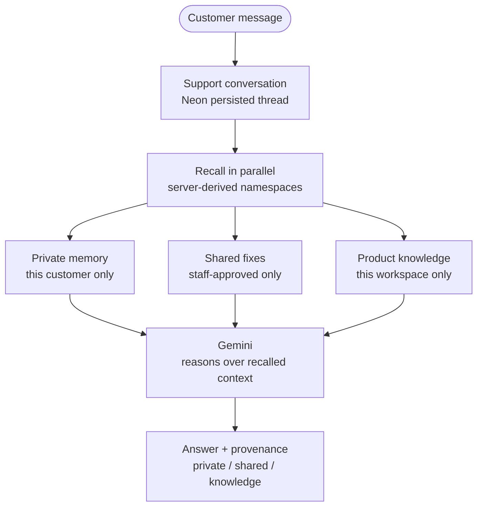
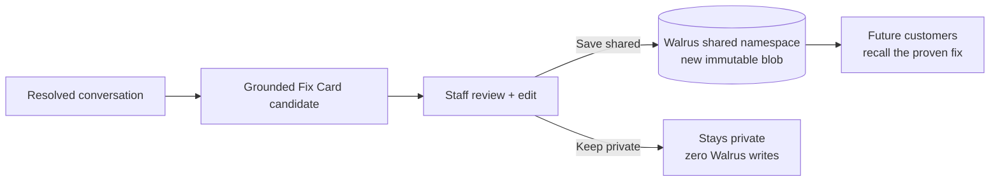

# Meros

Memory-native customer support.

> Solve it once. Remember it for everyone.

## Project Links

**Live App:** https://usemeros.vercel.app

**Demo Video:** https://youtu.be/9kmpZT66M4k?si=e17SXph7HeJx7L5x

**Medium Article:** https://medium.com/@kaelah679/how-meros-turns-support-conversations-into-shared-memory-20fa5ae4e4b1

## Submission Proof

**Walrus Network:** Mainnet

**Walrus Memory Agent ID:**  
`0xb812495947fc6e4276569d60da39da7cc86a3a1b47351abf9a6635987791229a`

**MemWal Delegate Public Key:**  
`9123dfc8a526eed234961f63f533665679bbda9c7faafa1d201a0dfa7b4084c5`

**Walrus Memory Integration:** MemWal SDK (`@mysten-incubation/memwal`)

**Connection Method:** `MemWal.create(...)`

**Durable Writes:** `rememberAndWait(...)`

**Semantic Recall:** `recall(...)`

**Mainnet Memories / Blobs:** 38

**Required Minimum:** 10

**Demo users:** Alice → Bob cross-customer shared-memory flow

---

Meros remembers each customer privately and turns confirmed, staff-approved resolutions into shared support memory. Returning customers continue with context. New customers with a recurring issue start from the proven fix — without seeing anyone else's history.

Walrus Memory · Gemini · Neon · Better Auth · Next.js

---

## The problem

Support forgets in two directions.

Customers return and repeat their environment, the original symptom, and steps that already failed. Teams solve a recurring issue once, then rediscover the same fix weeks later because the resolution disappeared with the closed conversation. A transcript archive does not fix this: useful facts stay buried, stale guesses look like facts, and personal context has no boundary.

## What Meros does

Meros keeps two separate memories for support:

- **Private memory** — each customer's durable context, recalled across sessions.
- **Shared memory** — only confirmed, sanitized, human-approved fixes, recalled for future customers with the same symptom.

Every answer shows which memory influenced it, and any answer can be rerun with memory disabled to show what changed.

> Share the fix. Keep the customer private.

---

## How it works: Alice → staff → Bob

The core loop, end to end:

1. **Alice** reports a CSV import failure at `/support/<workspace>`. The conversation and messages persist in Neon.
2. Meros recalls in parallel: Alice's **private memory**, staff-approved **shared fixes**, and workspace **product knowledge**, then asks Gemini to answer with that context.
3. Alice confirms the resolution works.
4. Meros drafts a sanitized **Fix Card candidate** (Symptom / Cause / Resolution).
5. Staff open the workspace console and review the exact candidate text. They can edit it before anything is shared.
6. Staff choose **Save shared** or **Keep private**. `Keep private` performs zero Walrus writes.
7. On approval, the reviewed fix is written as a new blob into the workspace **shared Walrus namespace**.
8. **Bob** later signs in on the same workspace and describes the same symptom.
9. Meros recalls the proven shared fix and checks that path first.
10. Bob gets the resolution. Nothing private about Alice travels with it.

Without memory: generic troubleshooting from scratch.

With Meros: the organization starts from what already worked.

---

## Memory architecture

Three durable semantic planes live in Walrus. One short-lived thread lives in Neon.

| Plane | Scope | Namespace pattern |
|---|---|---|
| Product knowledge | One workspace | `meros:v2:workspace:<workspace-id>:knowledge` |
| Shared support memory | One workspace, staff-approved fixes only | `meros:v2:workspace:<workspace-id>:shared:fixes` |
| Customer private memory | One customer in one workspace | `meros:v2:workspace:<workspace-id>:customer:<customer-id>` |
| Current conversation | One support thread | Persisted in Neon; recalled as recent turns, not semantic memory |

IDs are immutable content-derived hex (`lib/tenant.ts`). Namespaces are derived server-side from those IDs. Clients never submit IDs or namespaces.



On confirmed resolution:



## Why Walrus

Walrus is the memory layer, not an accessory store.

- **Durable semantic memory.** Private facts, shared fixes, and product knowledge are written with `rememberAndWait` and recalled semantically by issue context. A write counts as stored only after Walrus confirms completion with a blob reference.
- **Namespace isolation as the privacy boundary.** One customer's facts live under that customer's namespace. Another customer in the same workspace resolves to a different namespace and cannot recall them. One workspace cannot recall another workspace's planes.
- **Immutable history.** Blobs are never edited in place. Corrections write a new blob; the old record stays auditable while active recall filters it out.

What Walrus does **not** do:

- It does not route requests, own product state, or authenticate humans.
- Neon owns relational state: users, orgs, workspaces, customers, conversations, messages, issues, Fix Card metadata, blob references.
- Gemini reasons over recalled context and produces answers, extractions, and candidate summaries. Gemini is not the memory store.
- Better Auth owns human identity and sessions. Memory identity (`workspace → customer`) is derived server-side from that session.

Recalled memory is treated as untrusted data in prompts: fenced, labeled, never instructions. The same fencing applies to uploaded file content.

---

## Memory on vs off: Compare without memory

Each assistant answer carries provenance — the **Memory Lens** ("Why this answer?") lists whether private, shared, or product-knowledge hits influenced it, with blob references.

**Compare without memory** reruns the same user question through `POST /api/compare` with the same conversation context but **zero Walrus recall calls**. The result is shown beside the original:

- **Memory on:** recalls a proven past resolution and asks the sharper first question.
- **Memory off:** has only the current thread and model knowledge, so it typically falls back to generic troubleshooting.

This is the causal proof judges can run on any answer: same request, same thread, memory removed.

---

## Privacy by design

- Private memory stays in `…:customer:<customer-id>`. Cross-customer recall is structurally impossible, not a query filter.
- Shared memory is scoped to one workspace (`…:shared:fixes`). Workspaces cannot read each other.
- Nothing becomes shared because Gemini generated it. Generation proposes; only a human disposes.
- Sharing requires, in order: a confirmed resolution → a Fix Card candidate → staff review of the exact text → explicit **Save shared**.
- Candidates pass redaction (emails, secrets, key patterns, namespace/ID leaks) and grounding checks (resolution must match user-confirmed action; Symptom/Cause claims must trace to customer-provided evidence, clause by clause).
- Raw uploaded attachment bytes are request-scoped: they ride one Gemini request as labeled user data and are never stored in Walrus. Only filename/type/kind metadata may persist.
- Customer identities and private chat history are never inserted into shared Fix Cards.

---

## Correcting shared memory

Walrus blobs are immutable, so Meros never rewrites a shared fix. Correction is a supersession:

1. Staff edit a shared card and save the correction.
2. Meros writes a **new** corrected blob to the shared namespace.
3. Neon marks the old Fix Card row `superseded` and sets `superseded_by_fix_card_id` to the new row. The old blob ID is preserved for audit.
4. Chat recall loads the workspace deny-list via `listSupersededSharedBlobs` and drops those blob IDs with `dropSupersededSharedHits` before building context.
5. The Shared console shows active fixes plus superseded history — recallable vs. auditable, never mixed.

A wrong fix therefore stays visible as history but stops influencing answers.

---

## Multimodal support

The customer composer supports text plus attachments and voice, kept small on purpose — memory remains the product:

- **Images:** PNG, JPG/JPEG, WEBP
- **Documents:** PDF, TXT, CSV, MD
- **Voice:** browser-recorded audio (WebM, MP4/M4A, MP3, OGG/OGA, WAV)
- **Limits:** up to 3 files per message, 2 MiB per file, voice clips up to 180 seconds
- **Reasoning:** attachments are sent as native Gemini multimodal parts on the current turn only, labeled as untrusted user data
- **Persistence:** only `{ filename, mimeType, kind }` metadata may be stored with the message; raw bytes never reach DB rows or Walrus

---

## Architecture

| Layer | Responsibility |
|---|---|
| Walrus (MemWal, Mainnet) | Durable semantic memory: private / shared / knowledge planes, recall + `rememberAndWait` writes |
| Neon Postgres | Relational and canonical state: identity registry, conversations, messages, issues, Fix Cards, knowledge source text, blob references |
| Gemini | Answer generation, fact extraction, Fix Card drafting; primary `gemini-3.5-flash-lite` with `gemini-3.7-flash` fallback on retryable failures |
| Better Auth | Human identity and sessions; product identity is derived server-side from the session |
| Next.js App Router | Product UI, API routes, server gates |

Key flows:

- `POST /api/chat` — authenticate → persist user message → bounded recall (10s per plane) → Gemini answer → persist answer + provenance → optional Fix Card candidate on explicit resolution.
- `POST /api/memory/capture` — after the answer renders, extract durable facts and `rememberPrivate` into the customer's namespace; endpoint-level skips stay silent so the UI only warns on a real failed write.
- `POST /api/compare` — same question, same thread, no Walrus calls; baseline for the memory-on/off proof.
- `POST /api/fix-cards/[id]/review` — staff-only; `shared` writes a new blob, `kept_private` writes nothing, correction supersedes.
- `POST /api/workspaces/[slug]/knowledge` — workspace product material, canonical in Neon, indexed in the knowledge namespace.

---

## Tech stack

From `package.json` — no hidden dependencies:

- `next` 15 (App Router), `react` 19
- `@mysten-incubation/memwal` (Walrus Memory client), `@mysten/seal`, `@mysten/sui`
- `@neondatabase/serverless` + `pg` (Neon access)
- `better-auth` (sessions)
- `@google/genai` (Gemini)
- `tailwindcss`, `typescript`, `vitest`

---

## Repository structure

```text
app/                  Product routes + API routes
  support/[workspaceSlug]/  Authenticated customer chat
  app/workspaces/[slug]/    Staff console (overview, conversations, customers, fix-cards, shared, knowledge)
  api/chat|compare|memory|fix-cards|workspaces/  Memory and workflow endpoints
components/
  support-chat.tsx      Customer chat, Memory Lens, compare, private-capture status
  fix-card-review.tsx   Staff edit-before-share + correction UI
  customer-gate.tsx     Signed-out customer sign-in gate
lib/
  walrus.ts             remember/recall, bounded recall, namespace writes
  tenant.ts             Immutable IDs + v2 namespace derivation
  tenant-store.ts       Server-side workspace→customer resolution
  chat-memory.ts        Recall normalization + superseded-blob filter
  support-memory.ts     Grounding, redaction, extraction validation
  support-ops.ts        Conversations, issues, Fix Card persistence
  knowledge.ts          Product knowledge canonical + index
  attachments.ts        Validation + Gemini parts (bytes never persist)
  gemini.ts             Generation with timeouts + model fallback
db/
  schema.sql            Neon tables incl. fix_cards supersession columns
  better-auth-schema.sql Auth tables
docs/                 PRD, product idea, brand messaging, design notes
scripts/
  db-migrate.mjs        Additive/idempotent schema setup
```

---

## Running locally

```bash
npm install
npm run db:migrate
npm run dev
```

Open the app at the origin configured in `BETTER_AUTH_URL` (local default `http://localhost:3002`).

Verify:

```bash
npm test
npm run typecheck
npm run build
```

## Environment variables

Copy `.env.example` to `.env.local` and fill in real values. **Never commit `.env.local`.**

| Variable | Purpose |
|---|---|
| `DATABASE_URL` | Neon Postgres connection string |
| `MEMWAL_PRIVATE_KEY` | Walrus delegate key (hex or `suiprivkey1…`), server-only |
| `MEMWAL_ACCOUNT_ID` | Walrus Memory account object ID (`0x…`), server-only |
| `MEMWAL_SERVER_URL` | Walrus relayer URL; defaults to Mainnet relayer when unset |
| `MEROS_ID_SALT` | Salt for legacy bootstrap hashing; changing it remaps legacy namespaces |
| `GEMINI_API_KEY` | Gemini key for answers, extraction, Fix Card drafting |
| `GEMINI_MODEL` | Primary model ID; defaults to `gemini-3.5-flash-lite` |
| `GEMINI_FALLBACK_MODEL` | Fallback model ID; used only after retryable primary failures |
| `BETTER_AUTH_URL` | Public origin of the deployment; requests must match it |
| `BETTER_AUTH_SECRET` | Session signing secret; required in production, stable across restarts |
| `MEROS_ENABLE_LEGACY_DEV_IDENTITY` | Local diagnostics only (`/chat`, `/dev`, raw access-code endpoints). Unset means session-only. Never honored in production. |

`GET /api/health` reports safe config booleans only — no secrets, no Walrus/Gemini calls.

---

## Tests

```bash
npm test
```

The suite mixes fast pure tests and marked live integration tests (live Neon; Walrus-backed where marked). Scope covers tenant and namespace isolation, private capture status semantics, Fix Card grounding and review gates, shared-fix supersession and recall filtering, product-knowledge recall, multimodal validation and isolation, auth and session behavior, recall timeouts, Gemini retry bounds, and fixture hygiene that keeps test rows scoped to tracked IDs/emails.

---

## Demo flow for judges

1. Open `/support/<workspace>` as **Alice**. Ask the CSV import question without giving away the cause.
2. Work the thread, then confirm the fix in your own words (e.g. that re-exporting as comma-delimited UTF-8 worked).
3. Open the staff console at `/app/workspaces/<workspace>/fix-cards`. Open the pending Fix Card.
4. Inspect the exact Symptom/Cause/Resolution text, edit if needed, then **Save shared**. Note the new Walrus blob reference.
5. Sign out, then sign in as **Bob** on the same `/support/<workspace>` — a clean account with no private history.
6. Ask the equivalent symptom question without mentioning delimiters. Bob should get the proven fix first.
7. Open **Why this answer?** and confirm a `shared` provenance entry with the new blob.
8. Run **Compare without memory** on that answer and confirm the baseline returns to generic troubleshooting.
9. Optional: correct the shared card, confirm the old row shows superseded history, and confirm recall now uses only the corrected blob.

## Deployment / live demo

- **Live app:** https://usemeros.vercel.app
- **Demo video:** https://youtu.be/9kmpZT66M4k?si=e17SXph7HeJx7L5x
- **Medium article:** https://medium.com/@kaelah679/how-meros-turns-support-conversations-into-shared-memory-20fa5ae4e4b1

<!-- Screenshots: no image assets are checked into the repo yet.
     When ready, add to e.g. docs/screenshots/ and link the strongest four:
     1. landing hero, 2. Fix Card staff review, 3. Bob answer with shared provenance,
     4. memory-on vs memory-off comparison. -->

---

## Built for

Walrus Session 8 — Chatbots That Remember

## License

No license file is present in the repository. All rights reserved by default until a license is added.
